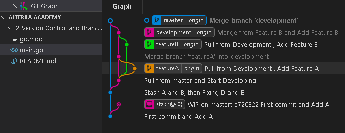

<h1 align="center">Assignment 1 - Git</h1>
<h2 align="center">Resume Materi</h2>

<ul>
    <li>Melakukan Git Push and Pull pada Repository Github</li>
    <li>Melakukan Git Stash untuk menyimpan code sementara yang kemudian di apply setelah melakukan fixing</li>
    <li>Melakukan Git Merge untuk menggabungkan 2 branch yang berbeda serta mengatasi Confict yang terjadi saat melakukan merge</li>
</ul>
 

    

