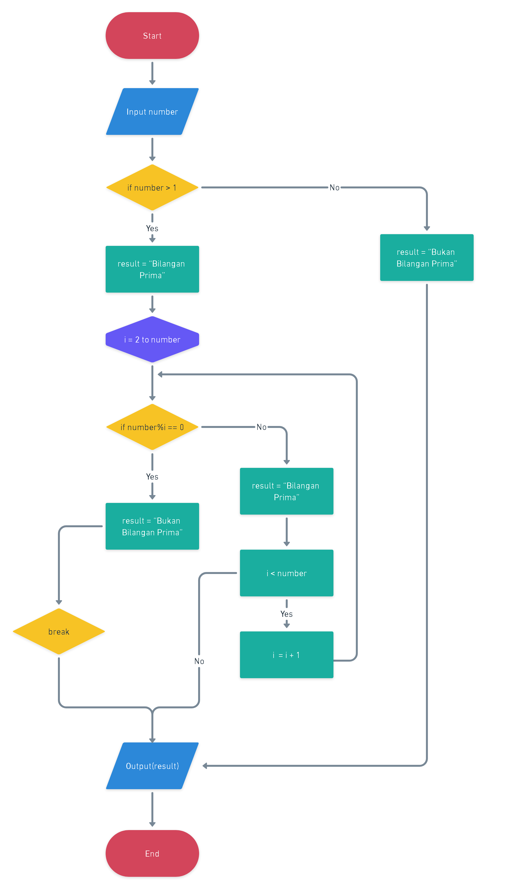
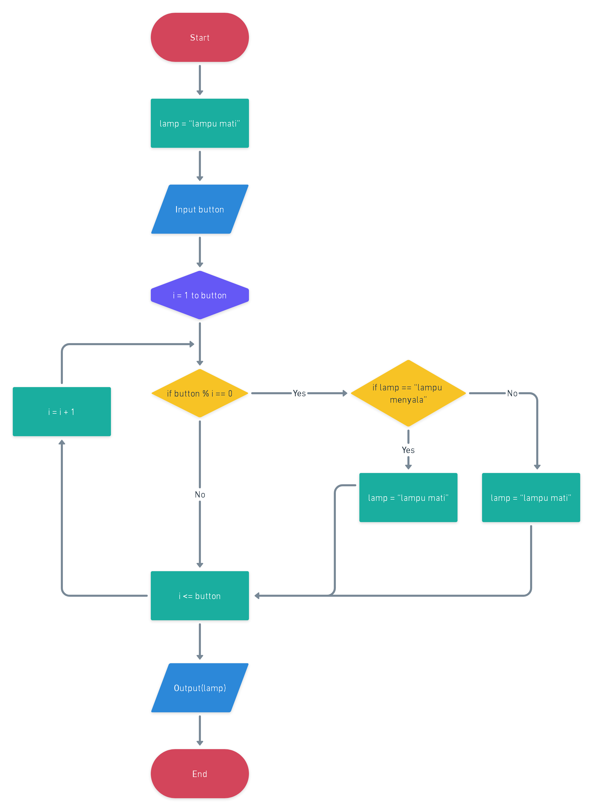
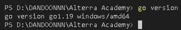
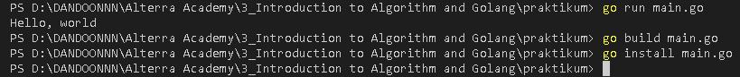

<h1 align="center">Assignment 2 - Introduction to Algorithm and Golang</h1>
<h2 align="center">Resume Materi</h2>

<ul>
    <li>Pengertian Algoritma</li>
        
 Algoritma adalah prosedur komputasi yang terdiri dari input kemudian proses yang akan menghasilkan output sesuai dengan tujuan

    <li>Pengertian Flowchart</li>
        
Flowchart adalah suatu bagan dengan simbol tertentu yang menggambarkan suatu tahapan atau urutan serta hubungan antar proses secara detail

    <li>Simbol simbol dalam flowchart serta Cara membuat flowchart untuk beberapa studi kasus</li>
</ul>
 

<h2>Problem 1 - Bilangan Prima</h2>

    

 
<h2>Problem 2 - Lampu dan Tombol</h2>

    

 
<h2>Problem 3 - Install GoLang</h2>

 
    Go Version 
    

 
<h2>Problem 4 - Hello World!</h2>

    

