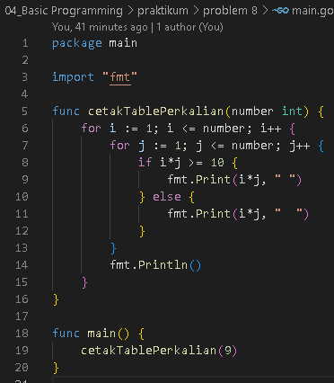

<h1 align="center">Assignment 3 - Basic Programming</h1>
<h2 align="center">Resume Materi</h2>

<ul>
    <li>Pengertian Variabel</li>
        
 Dalam Golang terdiri dari 3 Tipe data yaitu Boolean , Numeric dan String, dalam Numeric terbagi menjadi 3 yaitu integer, float dan complex

        
pada masing masing tipe data memiliki zero value yaitu berisi default value misalkan pada tipe integer adalah 0, pada tipe float adalah 0.0 dan lainnya

        
dalam golang juga terdapat data const atau tipe data yang tidak dapat diubah nilainya

    <li>Operator dalam Golang</li>
        
Operator Aritmatika : Sama seperti bahasa pemrogramman pada umumnya dalam Golang juga terdapat operator aritmatika addition(+), subtraction(-), division(/), multiplication(*), modulo(%), increment(++), serta decrement(--)

        
Operator Comparison : ==, !=, >, <, >=, <=

        
Operator Logika : &&, ||, !

        
Operator Bitwise : &, |, ^, <<, >>

        
Operator Assignment : =, +=, -=, /=, *=, %=, <<=, >>=, &=, 6=,|=

        
Operator Miscellaneous : &, * (Pointer)

    <li>Branching dan Looping</li>
        
Dalam mengontrol sebuah kondisi serta keputusan yang diambil dalam bahasa pemrogramman Golang menggunakan <b>if</b> dan <b>switch</b> serta untuk melakukan perulangan menggunakan <b>for</b>

</ul>
 

<h2>Problem 1 - Menghitung Luas Permukaan Tabung</h2>

    
     
    Output
    

 
<h2>Problem 2 - Grade Nilai</h2>

    
     
    Output
    

 
<h2>Problem 3 - Faktor Bilangan</h2>

    
     
    Output
    

 
<h2>Problem 4 - Bilangan Prima</h2>

    
     
    Output
    

 
<h2>Problem 5 - Palindrome</h2>

    
     
    Output
    

 
<h2>Problem 6 - Exponentiation</h2>

    
     
    Output
    

 
<h2>Problem 7 - Play With Asterisk</h2>

    
     
    Output
    

 
<h2>Problem 8 - Cetak Tabel Perkalian</h2>

    
     
    Output
    

