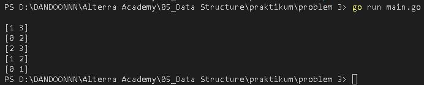
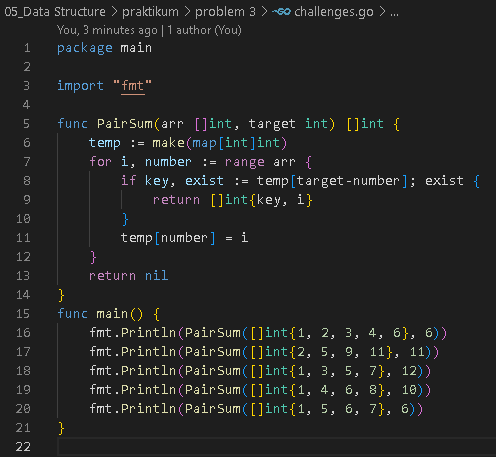

<h1 align="center">Assignment 4 - Data Structure</h1>
<h2 align="center">Resume Materi</h2>

<ul>
    <li>Pengertian Array dan Slice</li>
        
Array berisi kumpulan dari beberapa elemen data, Array memiliki ukuran yang tetap atau statis, array dapat berisi numeric , string ataupun boolean

        
Tiap tiap dalam array memiliki index yang dimulai dari index ke 0, array juga memiliki zero value ketika data yang dimasukkan ke array tidak memenuhi kapasitas, zero value akan berisi zero value dari tipe data yang ditentukan

        
Sedangkan Slice berisi kumpulan dari beberapa elemen data seperti array namun ukuran slice dinamis, atau dapat berubah-ubah dengan ukuran kelipatan 2 dari ukuran sebelumnya, serta memiliki zero value yaitu nil

    <li>Pengertian Map</li>
        
Map berisi beberapa elemen data, namun yang membedakan Map dan Array adalah key and value, array menggunakan index untuk mengakses data didalamnya sedangkan Map menggunakan key yang Unique untuk mengakses data didalamnya

    <li>Pengertian Function</li>
        
Function adalah serpihan code atau bisa disebut sub program yang dibuat untuk menyelesaikan suatu hal tertentu , function memiliki nama

</ul>
 

<h2>Problem 1 - Array Merge</h2>

    
     
    Output
     
    

 
<h2>Problem 2 - Angka Muncul Sekali</h2>

    
     
    Output
     
    

 
<h2>Problem 3 - Pair with Target Sum</h2>

    
     
    Output
     
    

 
<h2>Challenges Problem 3 - Membuat dengan Time Complexity O(n)</h2>

    
     
    Output
     
    

