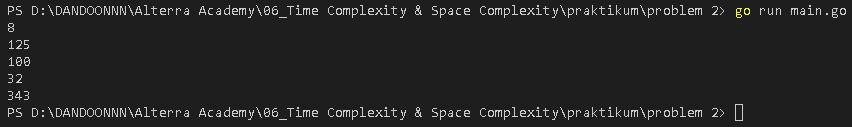

<h1 align="center">Assignment 5 - Time Complexity & Space Complexity</h1>
<h2 align="center">Resume Materi</h2>

<ul>
    <li>Pengertian Time Complexity</li>
        
Time Complexity adalah seberapa lama waktu yang dibutuhkan untuk menjalankan suatu algoritma pemrograman

        
Time Complexity di deskripsikan dengan menggunakan Notasi Big-O seperti dibawah ini

        <ul>
            <li>Constant Time - O(1)</li>
            <li>Linear Time - O(n)</li>
            <li>Linear Time - O(n + m)</li>
            <li>Logaritmic Time - O(log n)</li>
            <li>Quadratic Time- O(n^2)</li>
            <li>Faktorial Time- O(n^2)</li>
            <li>Quadratic Time- O(n^2)</li>
        </ul>
        

    <li>Exponential and Factorial Time </li>
        
Terdapat jenis lain dari time complexity seperti factorial time O(n!) dan exponential time O(2^n). Algoritma dengan kompleksitas seperti itu hanya dapat menyelesaikan masalah untuk nilai n yang sangat kecil, karena akan memakan waktu terlalu lama untuk dieksekusi untuk nilai n yang besar.

    <li>Pengertian Space Complexity</li>
        
Space Complexity merupakan berapa banyak ruang dalam memori yang dibutuhkan dalam suatu algoritma ketika dijalankan, batasan memori memberikan informasi tentang kompleksitas ruang yang diharapkan

</ul>
 

<h2>Problem 1 - Bilangan Prima</h2>

    
     
    Output
     
    

 
<h2>Problem 2 - Fast Exponentiation</h2>

    
     
    Output
     
    

