<h1 align="center">Assignment 3 - Basic Programming</h1>
<h2 align="center">Resume Materi</h2>

<ul>
    <li>Pengertian Recursive</li>
        
Recursive keadaan dimana function akan memanggil function itu sendiri untuk menyelesaikan sebuah permasalahan

        
Recursive dapat digunakan untuk mempersingkat code dan memudahkan dalam penyelesaian suatu masalah yang sulit

        
Dalam recursive terdapat 2 hal yang harus diperhatikan yaitu base case dan recurrence relations(studi kasus dan hubungan rekursif)

    <li>Pengertian Number Theory</li>
        
Number Theory adalah cabang matematika yang mempelajari tentang bilangan bulat. ada banyak topik di bidang teori bilangan adalah bilangan prima, pembagi persekutuan terbesar, kelipatan persekutuan terkecil, faktorial, faktor prima, dll

    <li>Pengertian Searching dan Sorting</li>
        
Searching adalah proses menemukan posisi value yang terdapat didalam sebuah daftar value

        
Sorting adalah proses mengatur data dalam urutan tertentu seperti mengurutkan berdasarkan value, misalkan : angka, kata, ataupun pasangan

</ul>
 

<h2>Problem 1 - Prima ke X</h2>

    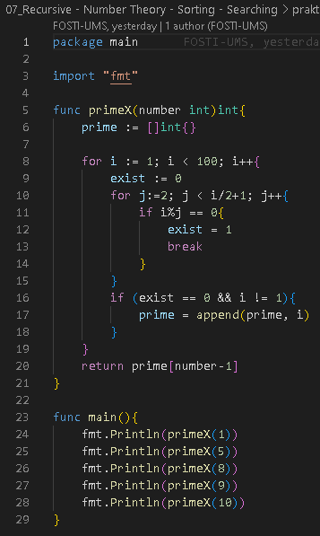
     
    Output
     
    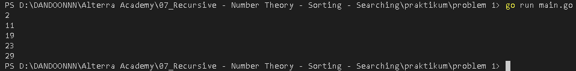

 
<h2>Problem 2 - Fibonacci(Recursive)</h2>

    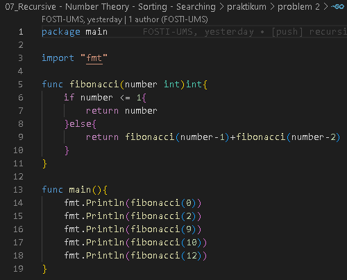
     
    Output
     
    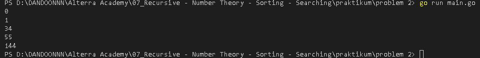

 
<h2>Problem 3 - Prima Segi Empat</h2>

    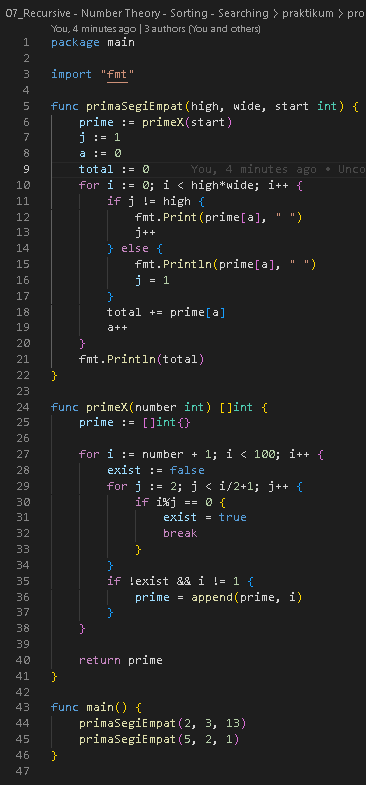
     
    Output
     
    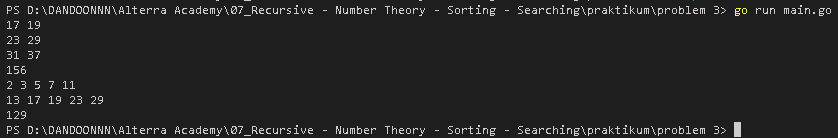

 
<h2>Problem 4 - Total Maksimum Dari Deret Bilangan</h2>

    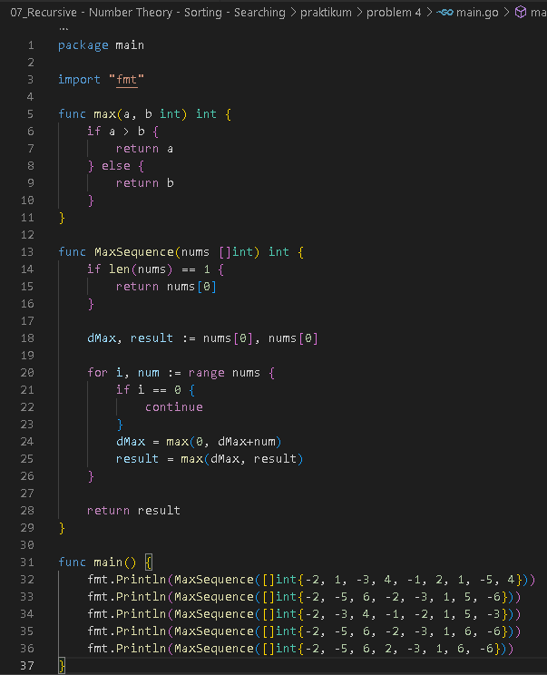
     
    Output
     
    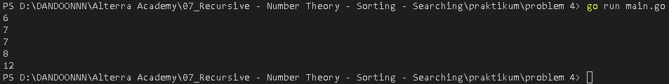

 
<h2>Problem 5 - Find Min and Max Number</h2>

    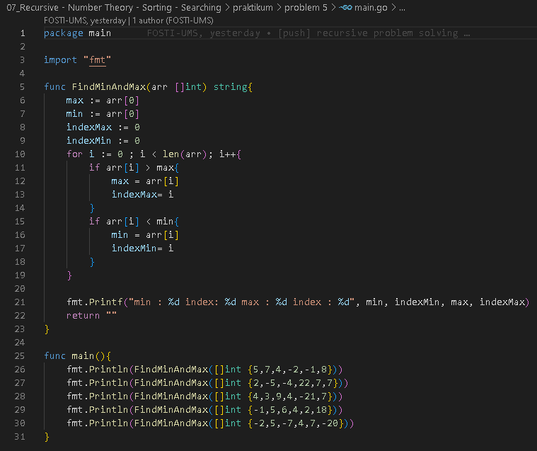
     
    Output
     
    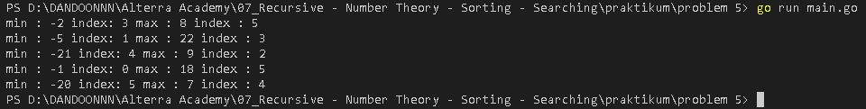

 
<h2>Problem 6 - Maximum Buy Product</h2>

    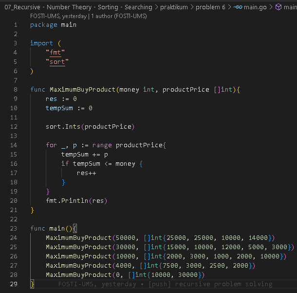
     
    Output
     
    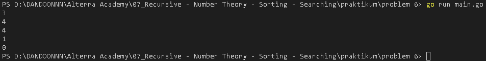

 
<h2>Problem 7 - Playing Domino</h2>

    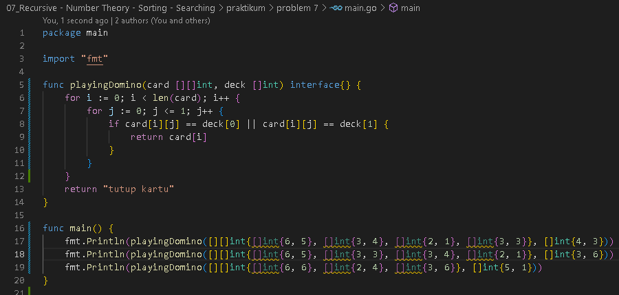
     
    Output
     
    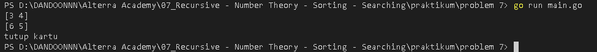

 
<h2>Problem 8 - Most Appear Item</h2>

    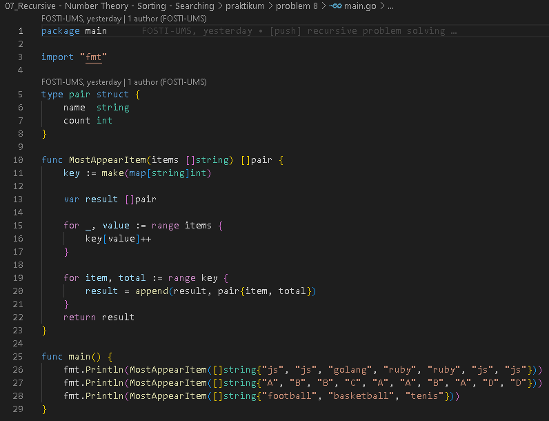
     
    Output
     
    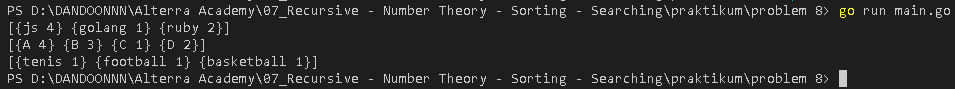

