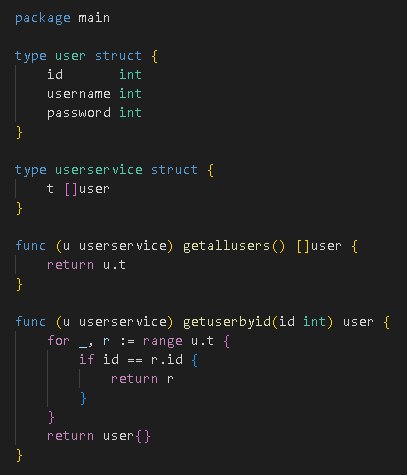
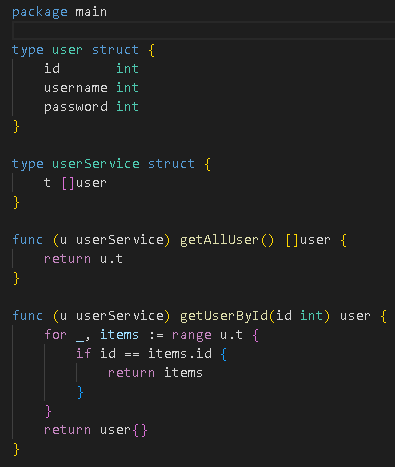
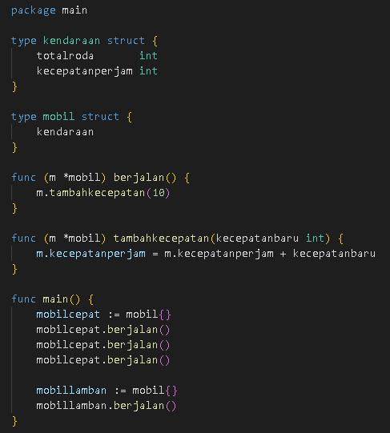
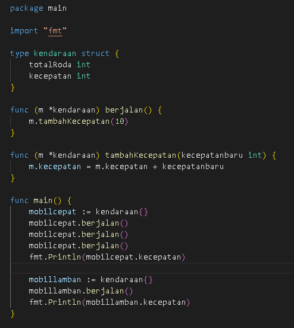

<h1 align="center">Assignment 7 - Clean Code</h1>
<h2 align="center">Resume Materi</h2>

<ul>
    <li>Pengertian Clean Code</li>
        
Clean Code adalah istilah untuk sebuah code yang mudah untuk dibaca, dipahami, dimengerti dan diubah oleh programmer

    <li>Alasan untuk Clean Code</li>
        
Clean Code dapat membantu dalam kerja sama antar pengembang sehingga dapat meningkatkan keefektifan kinerja serta dalam proses development akan lebih mudah dan lebih cepat

    <li>Karakteristik Clean Code dan Prinsip Clean Code</li>
        
- Mudah Dipahami

        
- Mudah Dieja dan Dicari

        
- Singkat namun mendeskripsikan konteks

        
- Konsisten

        
- Hindari penambahan konteks yang tidak perlu

        
- Komentar

        
- Good Function

        
- Gunakan Konvensi

        
- Formatting

         
        
 Prinsip Clean Code : KISS(Keep It So Simple), DRY(Dont Repeat Yourself) dan Refactoring

</ul>
 

<h2>Problem 1 - Analysis</h2>

    Before
     
    
     
    After
     
    

Penjelasan : Merubah penamaan struct dan juga menamaan function atau method yang awalnya seperti ini "user" menjadi "User" kemudian "getalluser" menjadi "getAllUser" serta merubah nama variabel dari variabel "r" menjadi variabel items agar mudah untuk dipahami

 
<h2>Problem 2 - Rewrite</h2>

    Before
     
    
     
    After
     
    

Penjelasan : Menghilangkan Struct Mobil, untuk menyederhanakan code, Mengubah penamaan variabel dan function atau method, yang tadinya seperti ini "totalroda" menjadi "totalRoda" serta merubah variabel "kecepatanperjam" menjadi "kecepatan" agar code mudah untuk dipahami

 