<h1 align="center">Assignment 8 - String - Advance Function - Pointer - Method - Struct and Interface</h1>
<h2 align="center">Resume Materi</h2>

<ul>
    <li>Strings dalam Golang</li>
        
- len : untuk menghitung jumlah karakter dalam string

        
- compare : untuk melakukan compare jumlah string

        
- constains : untuk melakukan cek apakah string 1 terdapat pada string 2

        
- replace : untuk mengganti bagian dari string dengan string tertentu

    <li>Variadic Function dan Method</li>
        
Variadic Function adalah pembuatan fungsi dengan parameter tak terbatas namun tipe data sama

        
Penggunaan Variadic function dengan cara mendeklarasikan parameter yang ditambahkan titik tiga kali (...)

        
Method adalah function yang melekat pada tipe data seperti struct atau tipe data lainya

    <li>Pointer, Struct dan Interface</li>
        
Pointer adalah reference atau alamat memori, variabel ini berisi alamat memori dari suatu nilai

        
Struct adalah kumpulan definisi variabel atau fungsi yang dibungkus sebagai tipe data baru dengan nama tertentu

        
Interface adalah kumpulan definisi method yang tidak memiliki isi yang dibungkus menjadi satu dengan nama tertentu

</ul>
 

<h2>Problem 1 - Compare String</h2>

    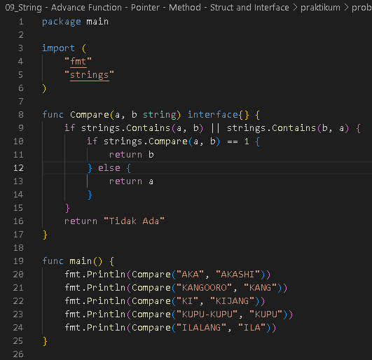
     
    Output
     
    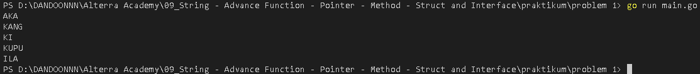

 
<h2>Problem 2 - Caesar Cipher</h2>

    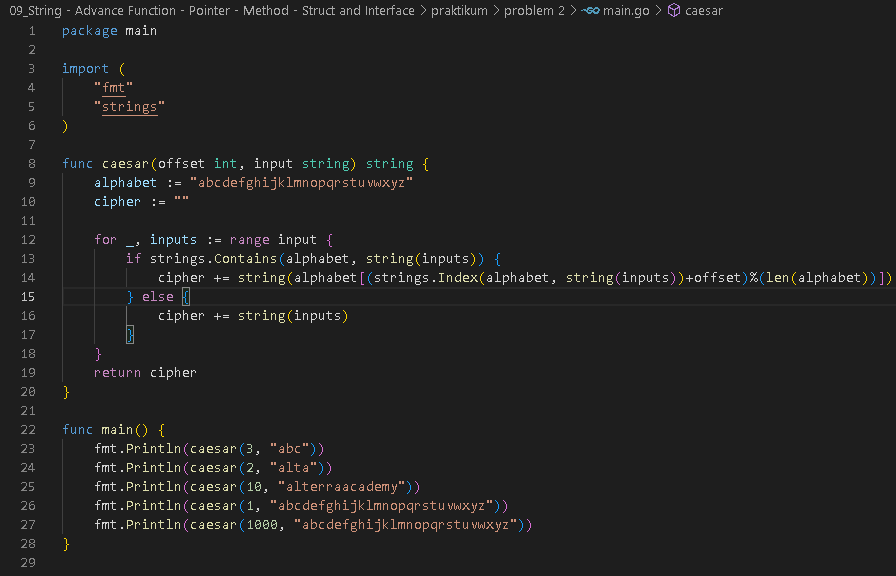
     
    Output
     
    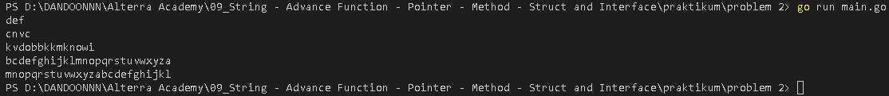

 
<h2>Problem 3 - Swap Two Number Using Pointer</h2>

    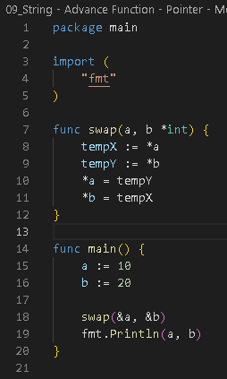
     
    Output
     
    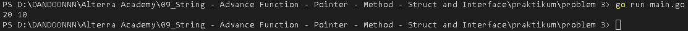

 
<h2>Problem 4 - Min and Max Using Pointer</h2>

    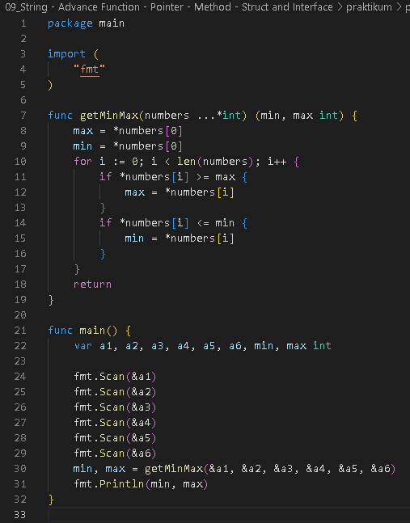
     
    Output
     
    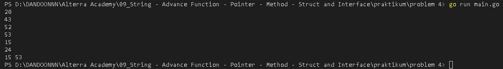

 
<h2>Problem 5 - Students Score</h2>

    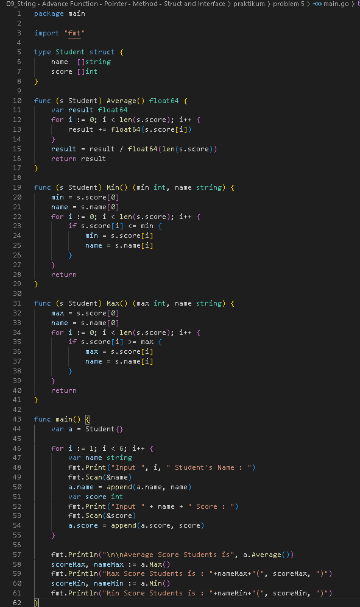
     
    Output
     
    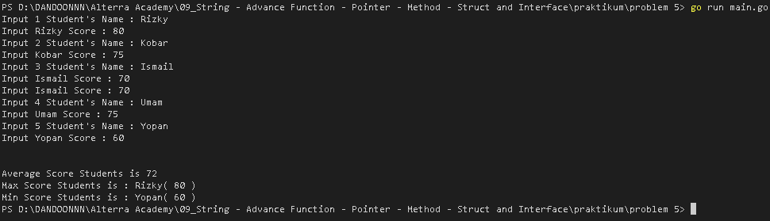

 
<h2>Problem 5 - Students Score Using Map Data Structure</h2>

    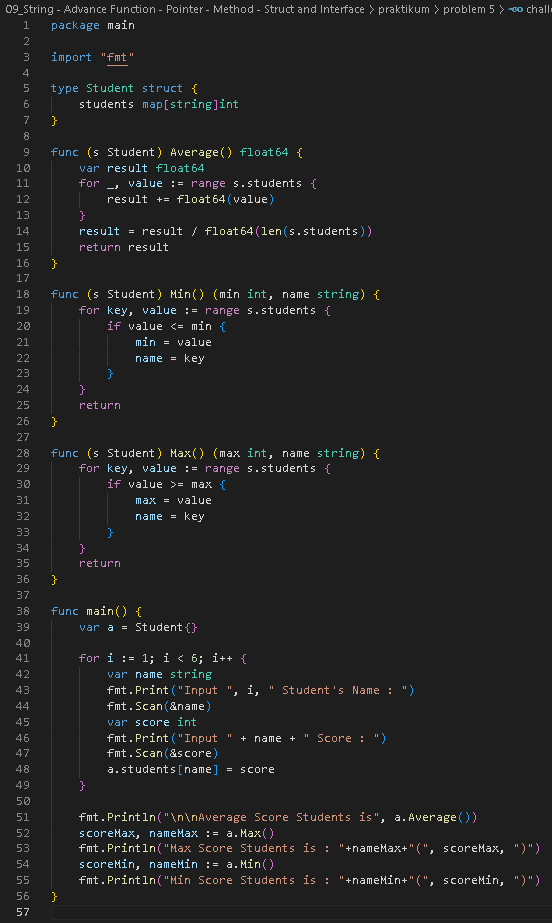
     
    Output
     
    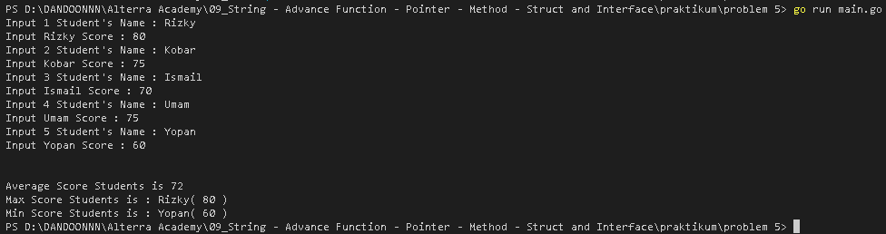

 
<h2>Problem 6 - Substitution Cipher</h2>

    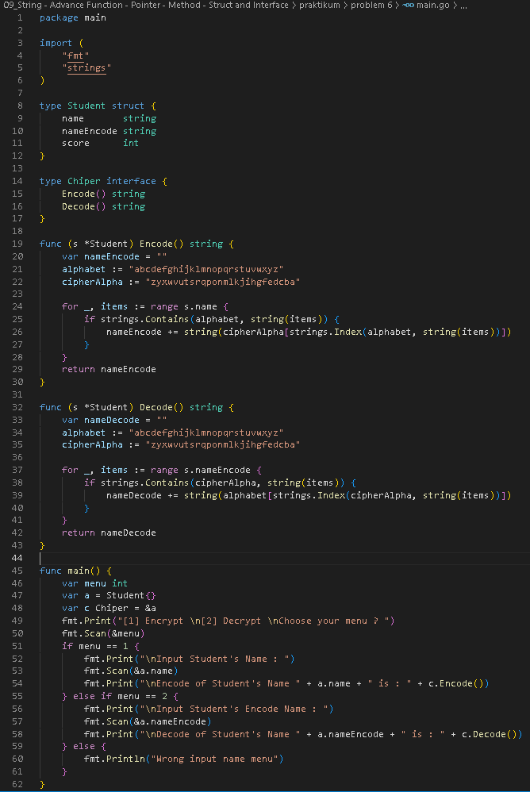
     
    Output
     
    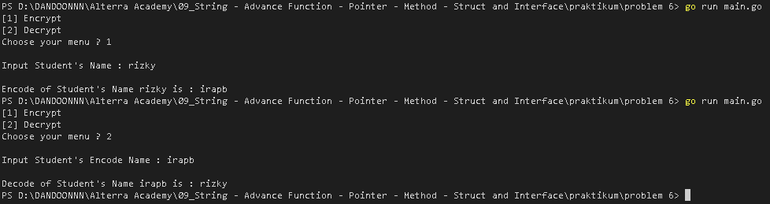

