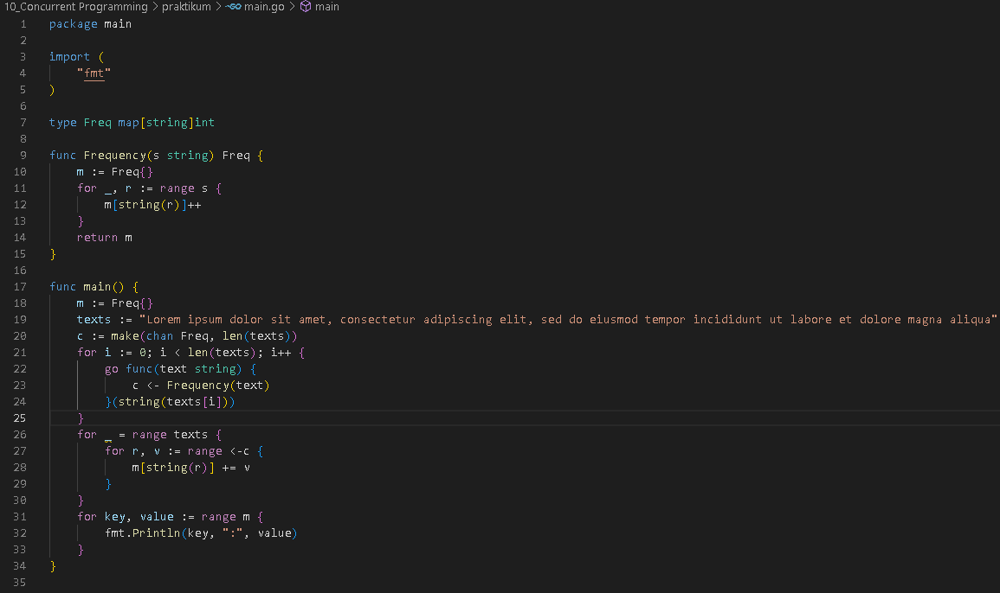
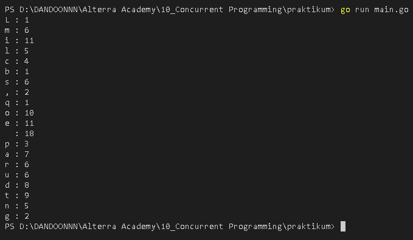

<h1 align="center">Assignment 9 - Concurrent Programming</h1>
<h2 align="center">Resume Materi</h2>

<ul>
    <li>Sequintal , Paralel dan Concurrent Program</li>
        
Dalam Sequintal program kita harus menyelesaikan proses sebelumnya untuk lanjut ke proses selanjutnya

        
Dalam Paralel program kita dapat menjalankan beberapa proses dalam satu waktu 

        
Dalam Concurrent Program kita dapat menjalankan banyak proses secara independen atau secara bersamaan

    <li>Pengertian Goroutines</li>
        
Goroutines adalah function atau method yang berjalan secara bersamaan atau independen dengan function atau method lain

    <li>Pengertian Channel dan Select</li>
        
Channel adalah object komunikasi yang digunakan dalam goroutines untuk berkomunikasi satu sama lain

        
Select memudahkan untuk mengontrol komunikasi data melalui satu atau banyak channel

</ul>
 

<h2>Problem 1 - Letter Frequency (Concurrent)</h2>

    
     
    Output
     
    

