<h1 align="center">Assignment 10 - Database-DDL-DML</h1>
<h2 align="center">Resume Materi</h2>

<ul>
    <li>Pengertian Database</li>
        
Database adalah Sekumpulan data yang terorganisisr atau saling berhubungan

        
Ada beberapa relationship dalam database antara lain : One to One, One to Many dan Many to Many

    <li>Pengertian DDL (Data Definition Language)</li>
        
DDL merupakan salah satu SQL atau Structure Query Language

        
DDL merupakan bahasa pemrograman dalam komputer yang dapat dimanfaatkan untuk membuat, memodifikasi struktur dari suatu object dalam database yang utamanya berbentuk skema

    <li>Pengertian DML (Data Manipulation Language)</li>
        
DML adalah perintah yang digunakan untuk memanipulasi data dalam table dari suatu database

</ul>
 

<h2>Problem 1 - Schema Database</h2>

    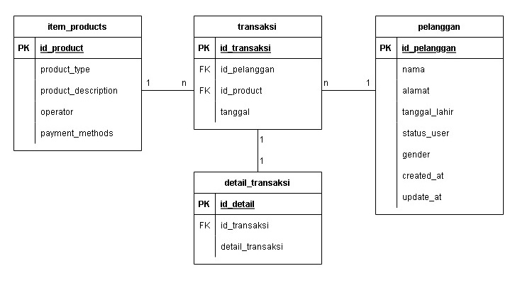
     

<h2>Problem 2 - Data Definition Language</h2>

Create Database alta_online_shop

    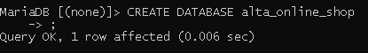
     

Create table user

    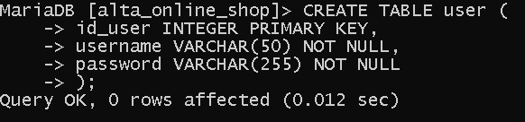
     

Create table product

    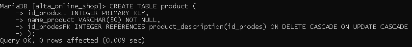
     

Create table product_type

    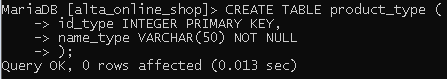
     

Create table operators

    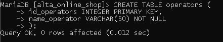
     

Create table product description

    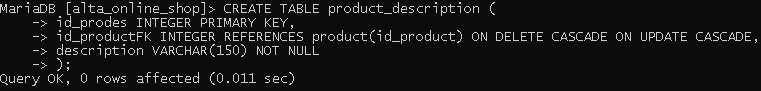
     

Create table payment method

    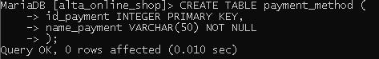
     

Create table transaction dan transaction detail

    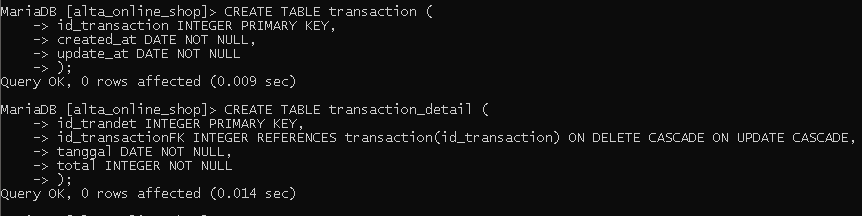
     

Create table kurir

    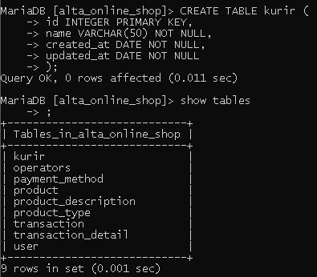
     

Tambah kolom ongkos_dasar pada table kurir

    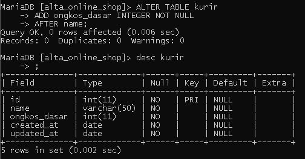
     

Rename table kurir menjadi shipping

    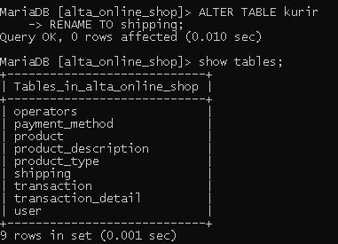
     

Hapus table shipping

    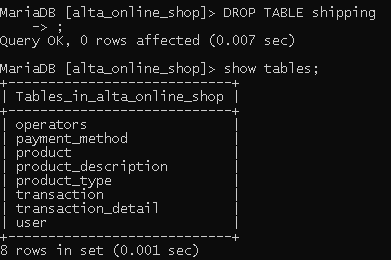
     

1-to-1 Payment mehtod description

    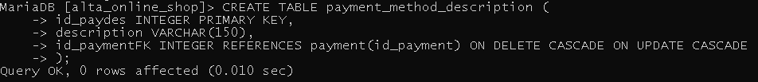
     

1-to-many user dengan alamat

    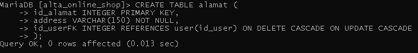
     

many-to-many user dengan payment method menjadi user_payment_method_detail

    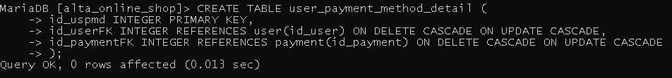
     

