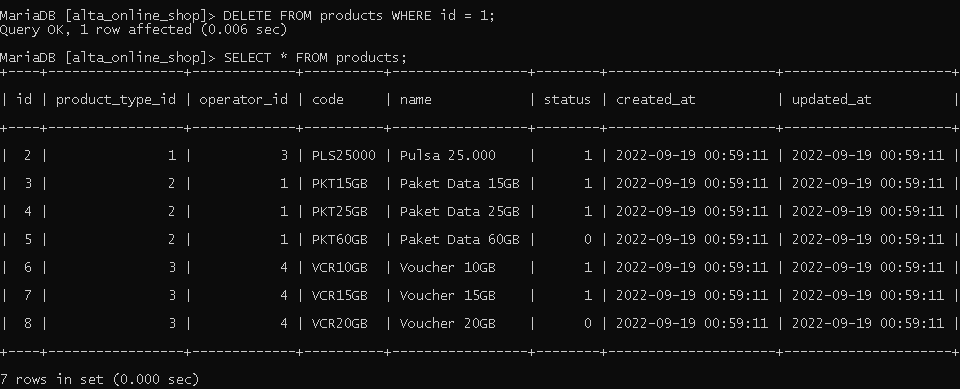

<h1 align="center">Assignment 11 - Join - Union - Agregasi - Subquery - Function (DBMS)</h1>
<h2 align="center">Resume Materi</h2>

<ul>
    <li>Pengertian Join, Union dan Agregasi</li>
        
Join adalah Sebuah klausa untuk menggabungkan data dari 2 atau lebih table yang saling berhubungan atau memiliki 1 field yang sama

        
Join terdapat beberapa jenis antara lain : INNER JOIN, LEFT JOIN, RIGHT JOIN dan CROSSJOIN

        
Union adalah sebuah klausa untuk menggabungkan data dari 2 table atau lebih serta harus memiliki jumlah field yang sama

        
Agregasi adalah fungsi dimana nilai dalam beberapa baris dikelompokkan bersama untuk membentuk nilai ringkasan tunggal

        
Agregasi terdiri dari : MIN, MAX, SUM, AVG, COUNT dan HAVING

    <li>Pengertian SubQuery</li>
        
SubQuery atau Inner Query adalah Query yang terdapat didalam Query SQL lain

        
Sebuah Subquery biasa digunakan untuk mengembalikan data yang akan digunakan dalam query utama sebagai syarat untuk lebih membatasi data yang akan diambil

        
SubQuery dapat digunakan dengan SELECT, INSERT, UPDATE dan DELETE disertai dengan statement operator seperti =, <, >, >=, <=

    <li>Pengertian Function dalam MySQL</li>
        
Function didalam MySQL adalah sekumpulan statement yang akan mengembalikan sebuah nilai balik pada saat pemanggilannya

</ul>
 

<h2>Insert</h2>

Insert 5 Operators

    

Insert 3 Product Type

    

Insert 2 Product dengan product type id = 1 dan operator id = 3

Insert 3 Product dengan product type id = 2 dan operator id = 1

Insert 3 Product dengan product type id = 3 dan operator id = 4

    

Insert Product Description pada setiap product

    

Insert 3 Payment Method

    

Insert 5 User

    

Insert 3 transaksi di masing masing user

    

Insert 3 Product di masing masing transaksi

    

<h2>Select</h2>

Tampilkan nama user dengan gender M atau Laki-laki

    

Tampilkan product dengan id = 3

    

Tampilkan Data Pelanggan dengan created_at 7 hari kebelakang dan memiliki gender mengandung kata M

    

Hitung jumlah user dengan status gender perempuan

    

Tampilkan data pelanggan dengan urutan berdasarkan gender

    

Tampilkan 5 data pada data product

    

<h2>Update</h2>

Ubah data product id 1 dengan nama 'product dummy'

    

Update qty = 3 pada transaction detail dengan product id 1

    

<h2>Delete</h2>

Delete data pada table product dengan id 1

    

Delete data pada tabel product dengan product type id 1

    

<h2>Join, Union, Sub Query, Function</h2>

Gabungkan data transaksi dari user id 1 dan user id 2

    

Tampilkan jumlah harga transaksi user id 1

    

Tampilkan total transaksi dengan product type 2

    

Tampilkan semua field table product, field name table product type yang saling berhubungan

    

Tampilkan semua field table transaction, field name table product dan field name table user

    

Buat function setelah data transaksi dihapus maka transaksi detail tehapus juga dengan transaksi id yang dimaksud

    

Buat function setelah data transaksi detail terhapus maka data total_qty terupdate berdasarkan qty data transaksi id yang terhapus

    

tampilkan data product yang tidak pernah ada didalam table transaction detail dengan subquery

    

