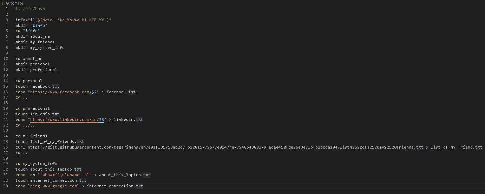
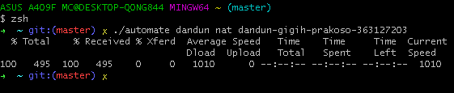

<h1 align="center">Assignment 12 - Command Line Interface (CLI)</h1>
<h2 align="center">Resume Materi</h2>

<ul>
    <li>Pengertian Command Line</li>
        
Command Line adalah antarmuka berbasis teks yang digunakan pengembang untuk berkomunikasi secara lebih efektif dan efisien dengan komputer untuk menyelesaikan serangkaian tugas

    <li>Mengapa menggunakan Command Line</li>
        
- Command Line karena Granular control of an OS or application

        
- Manajemen yang lebih cepat dari sejumlah besar sistem operasi

        
- Kemampuan untuk menyimpan script untuk automate regular tasks

        
- Interface yang membantu pemecahan masalah, seperti masalah koneksi jaringan

    <li>Apa itu Shell dan Shell Script</li>
        
Shell, program yang berfungsi sebagai jembatan antara pengguna dan kernel

        
Shell Script, bahasa pemrograman yang dikompilasi berdasarkan perintah shell

</ul>
 

<h2>Problem 1 - Install oh-my-zsh</h2>

    
     

<h2>Problem 2 - Create Automation Script</h2>

Automation Script

    
     

Run Automation Script

    
     

Output Automation Script ( Lebih lengkap di folder praktikum/output )

    
     

