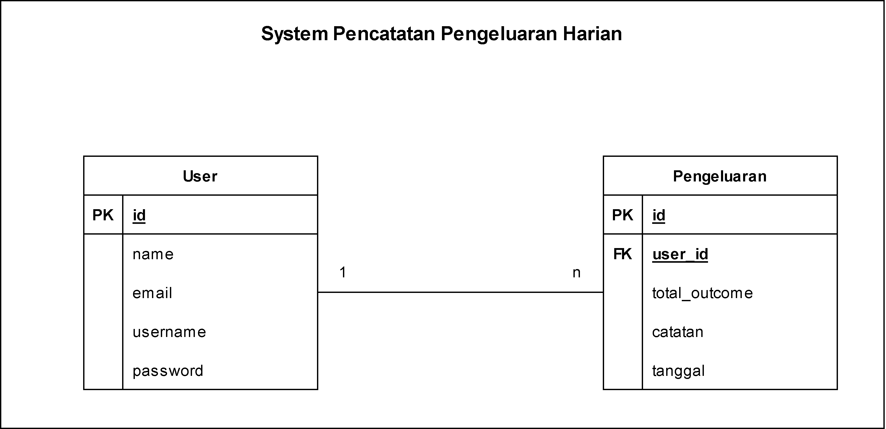

<h1 align="center">Assignment 13 - System Design</h1>
<h2 align="center">Resume Materi</h2>

<ul>
    <li>Pengertian Diagram</li>
        
Diagram adalah representasi simbolis dari informasi menggunakan teknik visualisasi

        
Jenis Jenis Diagram dalam System antara lain : Flowchart, Use Case Diagram (ringkasan detail pengguna sistem dan interaksi pengguna dengan sistem), Entity Relationship Diagram (Jenis Flowchart yang menggambarkan bagaimana tiap entitas saling berhubungan satu sama lain dalam suatu sistem)

    <li>Pengertian System Design</li>
        
Karakteristik utama Sistem Terdistribusi : 

        
- Scalability adalah kemampuan system, process, atau network untuk tumbuh dan mengelola peningkatan permintaan

        
- Reliability adalah kemungkinan suatu sistem akan gagal dalam periode tertentu

        
- Availability adalah waktu sistem tetap beroperasi untuk melakukan fungsi yang diperlukan dalam periode tertentu

        
- Efficiency adalah daya guna sistem yang mampu memenuhi fungsi yang diperlukan

        
- Serviceability and Manageability adalah kesederhanaan dan kecepatan di mana sistem dapat diperbaiki atau dipelihara

    <li>Pengertian Job/Work Queue, Load Balancing, Monolithic and Microservices</li>
        
Dalam perangkat lunak sistem, Job Queue adalah struktur data yang dikelola oleh perangkat lunak penjadwal pekerjaan yang berisi pekerjaan untuk dijalankan

        
Work Queue adalah Framework untuk membangun aplikasi master-worker besar yang menjangkau ribuan mesin yang diambil dari cluster, cloud, dan grid

        
Load Balancing adalah komponen penting lainnya dari setiap sistem terdistribusi karena membantu untuk menyebarkan lalu lintas di sekelompok server untuk meningkatkan daya respon dan ketersediaan aplikasi, situs web, atau basis data

        
Aplikasi monolithic memiliki single basis kode dengan banyak modul didalamnya

        
Aplikasi Microservices adalah aplikasi dibuat dan terdiri dari banyak layanan yang digabungkan serta dapat digunakan secara independen

</ul>
 

<h2>Problem 1 - System Pencatatan Pengeluaran Harian</h2>

ER Diagram

    
     

 

    
     

 

Use Case Diagram

    
     

<h2>Problem 2 - Query</h2>

Query

MySQL = SELECT * FROM user;

Redis = GET user (key) atau HGETALL user

neo4j = RETURN *; atau (MATCH (u:user) RETURN u;)

cassandra = SELECT * FROM user;
