<h1 align="center">Assignment 14 - Intro RESTful API</h1>
<h2 align="center">Resume Materi</h2>

<ul>
    <li>Pengertian API</li>
        
API adalah seperangkat fungsi dan prosedur yang memungkinkan pembuatan aplikasi yang mengakses fitur atau data dari sistem operasi, aplikasi, atau layanan lainnya.

    <li>Pengertian REST (REpresentational State Transfer)</li>
        
REST adalah suatu gaya arsitektur API

        
REST menggunakan HTTP protocol

        
REST menggunakan format Request dan Response berupa JSON

        
REST juga memiliki beberapa method request yang sering digunakan yaitu GET, POST, PUT dan DELETE

    <li>Pengertian POSTMAN</li>
        
POSTMAN adalah HTTP Client untuk menguji layanan web

        
POSTMAN memudahkan untuk menguji, mengembangkan, dan mendokumentasikan API dengan memungkinkan pengguna dengan cepat mengumpulkan HTTP request serta kompleks

</ul>
 

<h2>Problem 1 - Postman</h2>

a. API https://newsapi.org/

Popular Article about Xiaomi in the Lastweek

    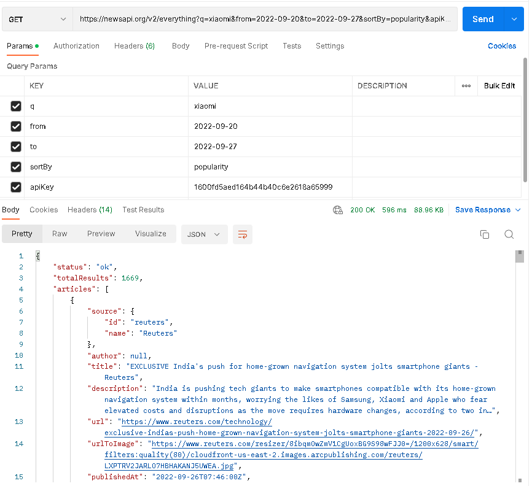
     

Article about business in India

    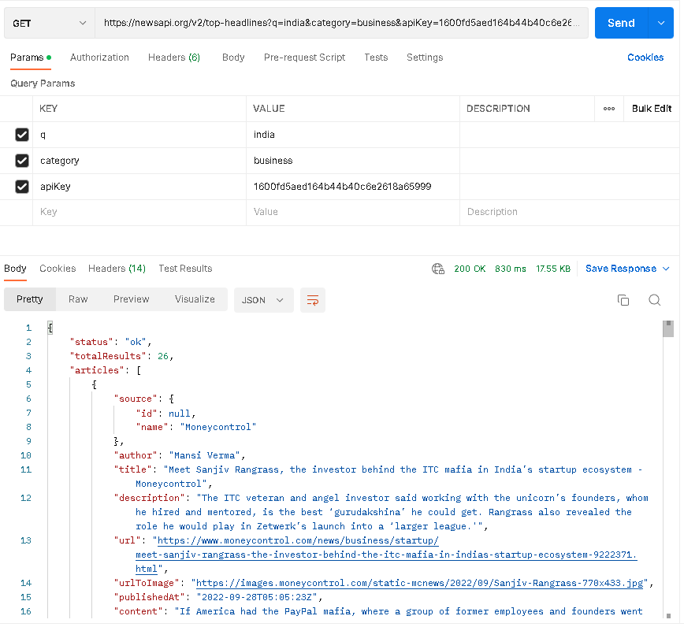
     

Popular Article about Apple in the Lastweek

    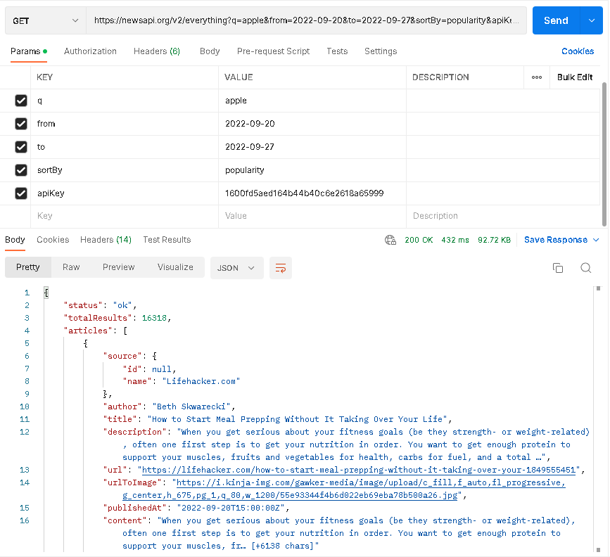
     

Article about indonesia sort by popularity

    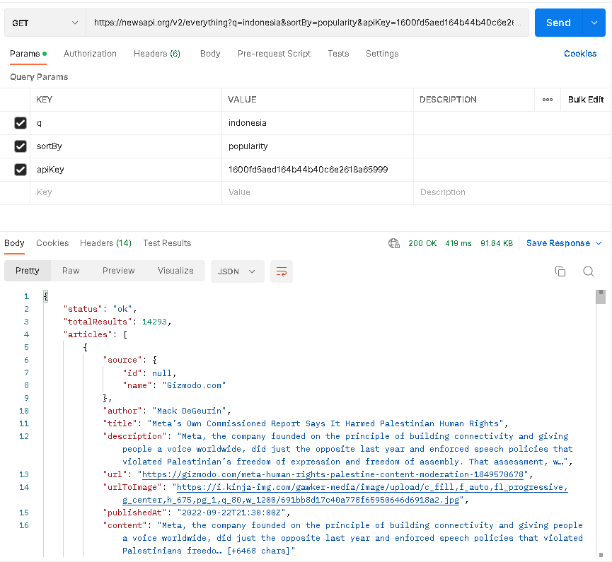
     

Article published by detik.com in the 6 last months sort by recent first

    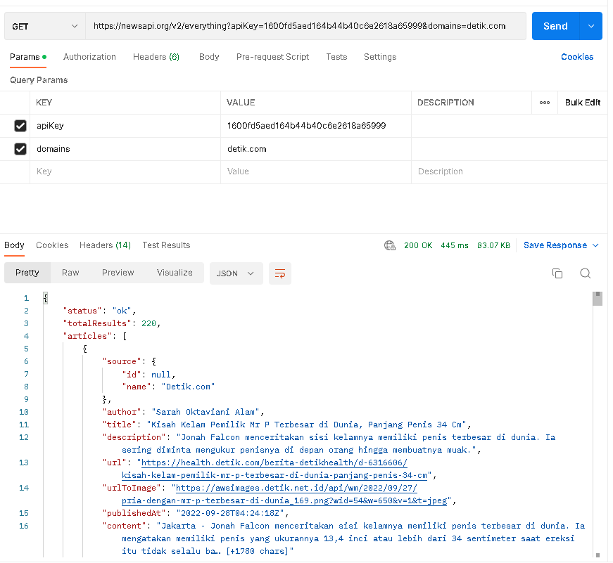
     

 

b. API https://swapi.dev/ 

People 1

    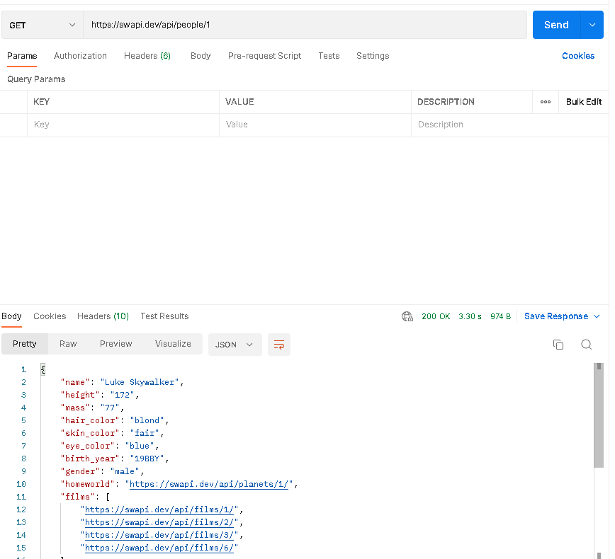
     

Planets 1

    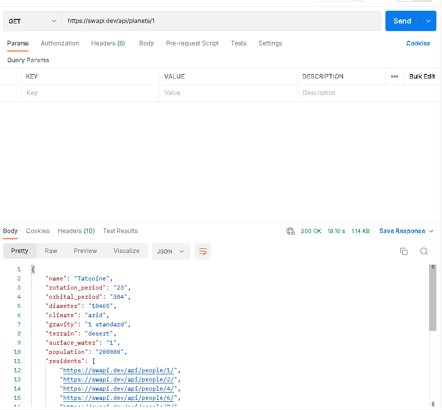
     

Starships 2

    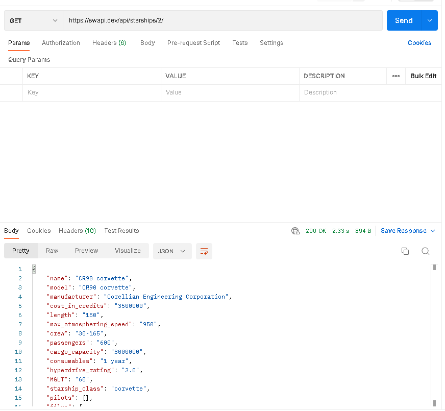
     

Get All Film

    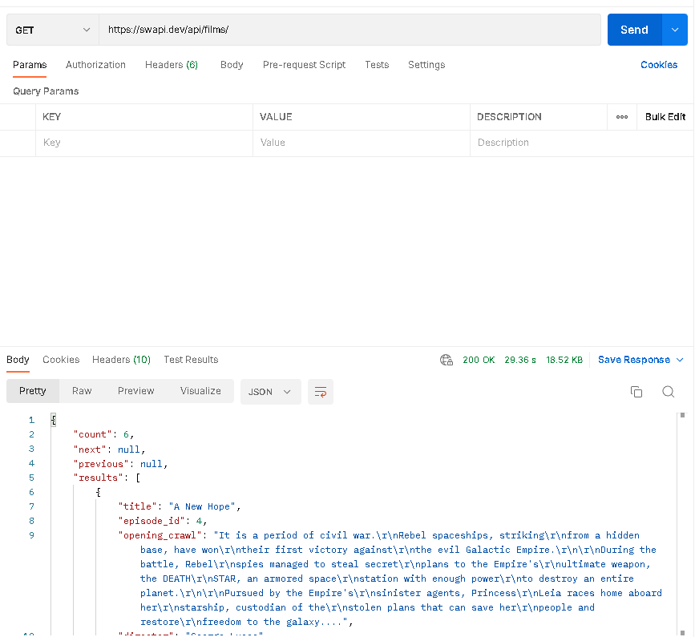
     

Get All Vehicle

    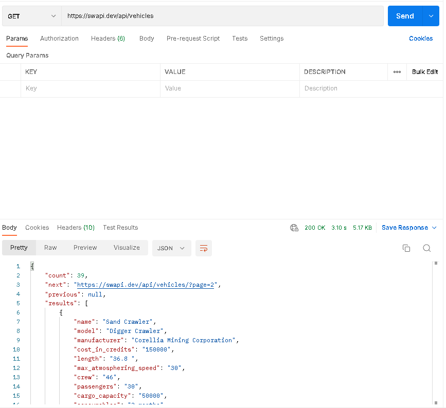
     

 

c. API https://app.swaggerhub.com/apis-docs/sepulsa/RentABook-API/1.0.0 dengan API server https://virtserver.swaggerhub.com/sepulsa/RentABook-API/1.0.0

Mengimplementasikan 4 buah method : GET, PUT, POST, DELETE

Method GET

    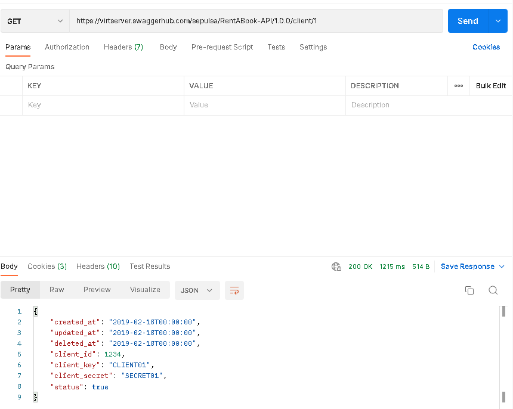
     

Method PUT

    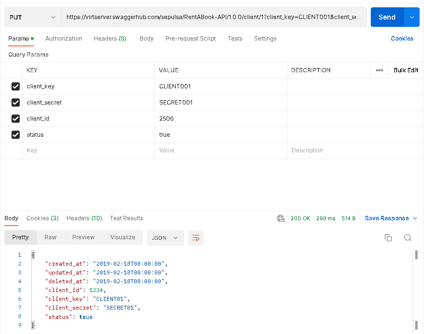
     

Method POST

    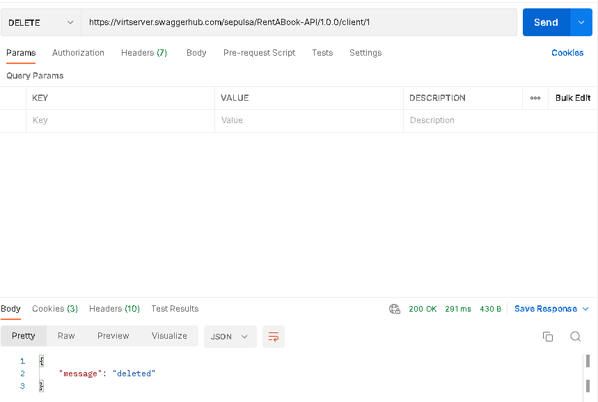
     

Method DELETE

    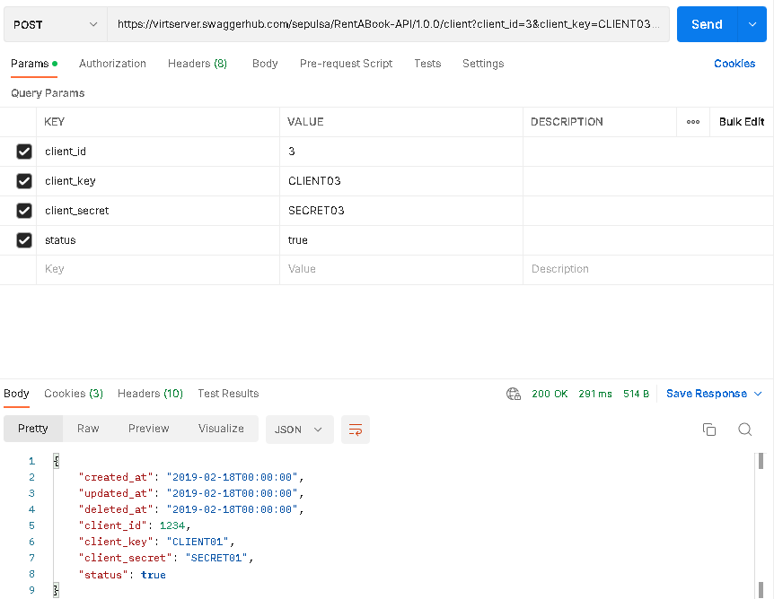
     

GET All Client

    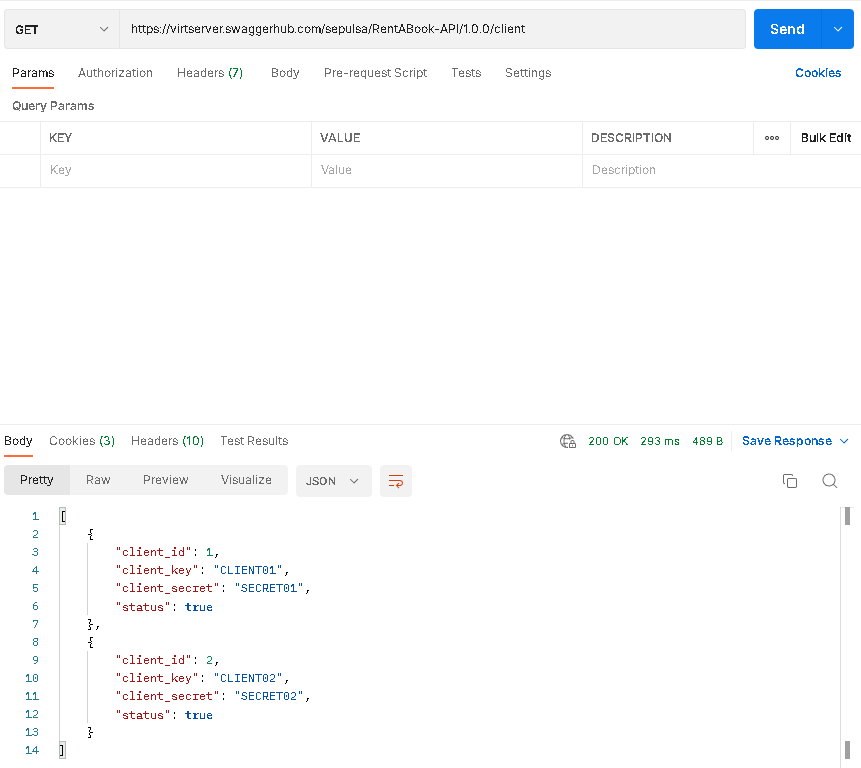
     

 