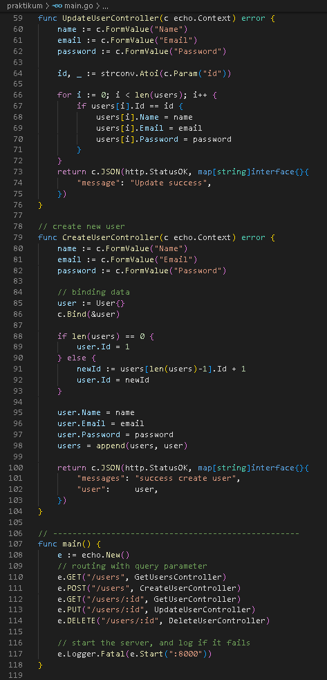

<h1 align="center">Assignment 15 - Intro Echo Golang</h1>
<h2 align="center">Resume Materi</h2>

<ul>
    <li>Pengertian Echo</li>
        
Echo merupakan framework golang untuk pengembangan aplikasi berbasis web

        
Echo merupakan framework minimalist but extensible

    <li>Beberapa Keuntungan Echo</li>
        
- Optimized Router

        
- Middleware

        
- Data Rendering

        
- Scalable

        
- Data Binding

    <li>Data Rendering, Retrieve Data, Binding Data</li>
        
Data yang di tampilkan menggunakan format JSON

        
Retrieve Data atau mengambil data dalam framework echo dapat dilakukan dengan berbagai cara antara lain : URL Params, Query Params, ataupun Form Value

</ul>
 

<h2>Static API CRUD User</h2>
<h4>Code</h4>

    
     
    
     

Run Code

    
     

<h4>Output</h4>

POST /users (Create New Users)

    
     
    
     
    
     

PUT /users/:id (Update User id = 1)

    
     

GET /users/:id (Get User by id = 1)

    
     

DELETE /users/:id (Delete User by id = 2)

    
     

GET /users (Get All User)

    
     

 