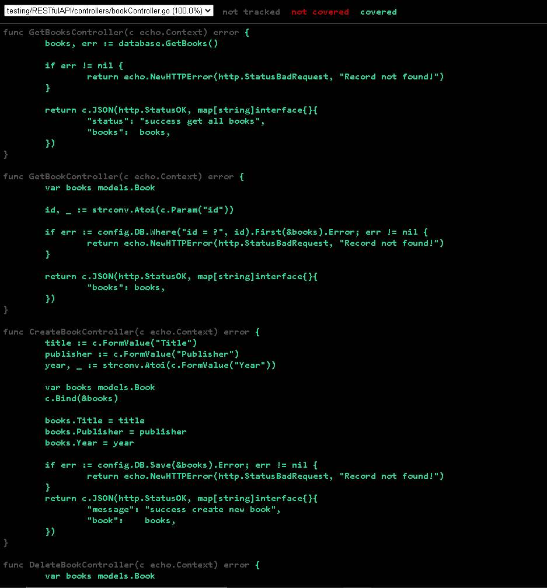

<h1 align="center">Assignment 18 - Unit Testing</h1>
<h2 align="center">Resume Materi</h2>

<ul>
    <li>Pengertian Software Testing</li>
        
Software Testing merupakan Proses menganalisis sebuah item software untuk mendeteksi perbedaan antara kondisi yang ada dan kondisi yang diinginkan dan juga untuk mengevaluasi fitur item software

    <li>Tingakatan Testing</li>
        
1. UI Testing : (End to End) Uji interaksi keseluruhan melalui UI

        
2. Integration Testing : Menguji modul modul atau subsistem tertentu melalu API

        
3. Unit Testing : Menguji bagian bagian terkecil yang dapat diuji dari suatu aplikasi melalui method

    <li>Pengertian Mocking dan Coverage</li>
        
Mocking merupakan cara pengujian perilaku sebuah service dengan cara membuat object palsu sehingga pengujian terisolasi dari object yang sebenarnya

        
Coverage adalah untuk mengetahui apakah unit testing yang dilakukan sudah memenuhi semua logic yang dibuat

</ul>
 

<h2>Problem 1</h2>
<h3>Calculate Test</h3>

    
     
    
     

<h2>Problem 2</h2>
<h3>RESTful API Testing</h3>

    
     

<h4>Book Controller</h4>

    
     

<h4>User Controller</h4>

    
     

