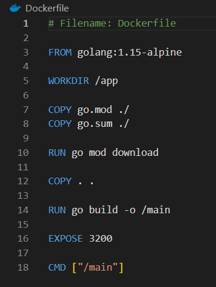
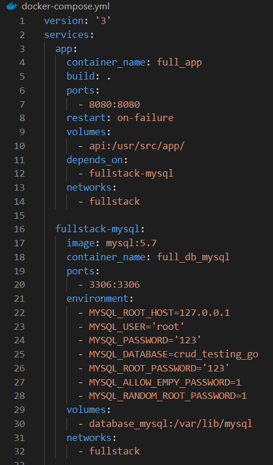
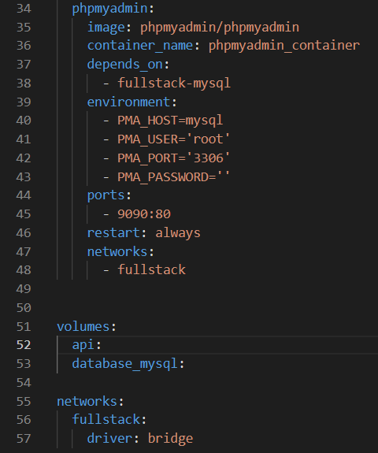
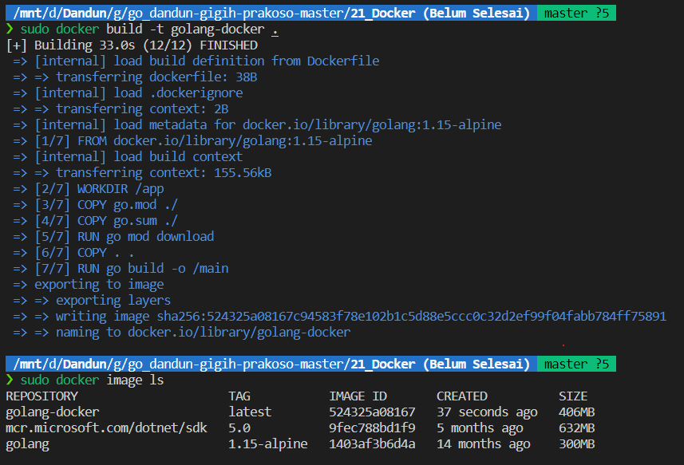
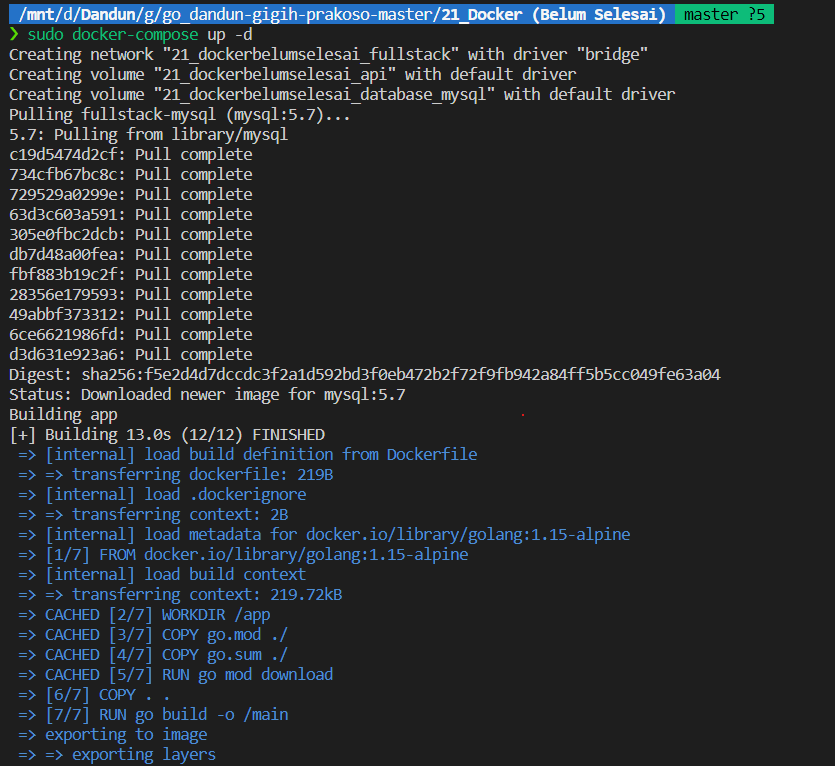
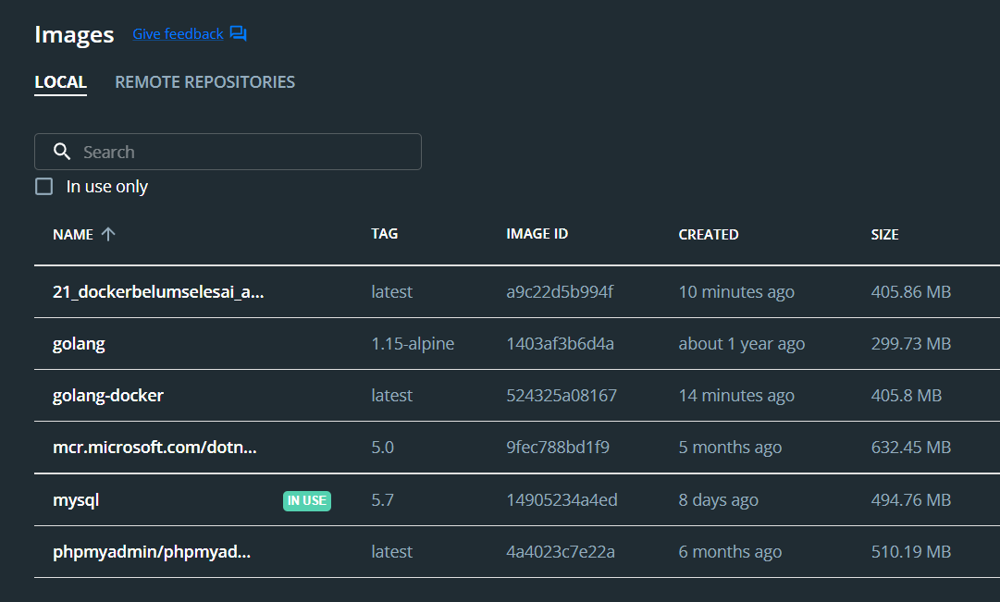
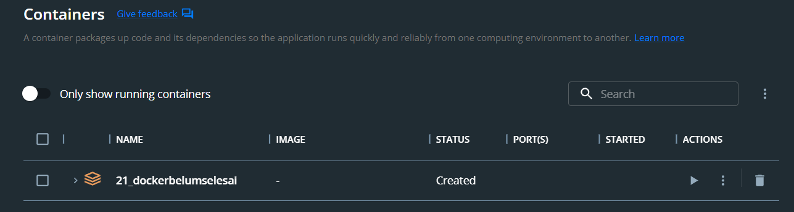
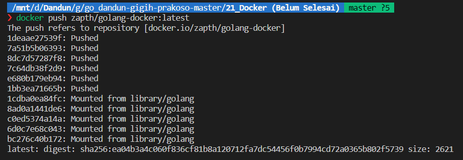

<h1 align="center">Assignment 20 - Docker</h1>
<h2 align="center">Resume Materi</h2>

<ul>
    <li>Pengertian Docker</li>
        
Docker adalah layanan yang menyediakan kemampuan untuk mengemas dan menjalankan sebuah aplikasi dalam sebuah lingkungan terisolasi yang disebut dengan container

    <li>Container vs Virtual Machine</li>
        
Container adalah  paket atau aplikasi yang mengandalkan isolasi virtual untuk menjalankan aplikasi yang dapat menjalankan sistem operasi kernel secara simultan tanpa memerlukan mesin virtual (VMs)

        
Virtual Machine adalah sebuah emulasi dari sebuah sistem komputer. Virtual Machine dapat membuat kita membagi resource hardware dari satu hardware fisik menjadi beberapa sistem komputer

    <li>Syntax Docker</li>
        
a.	FROM : mendapatkan gambar dari register docker

        
b.	RUN : Menjalankan perintah bash saat membangun container

        
c.	ENV : Mengatur variable di dalam container

        
d.	ADD : Menyalin file dengan beberapa proses lain

        
e.	COPY : Menyalin filenya

        
f.	WORKDIR : Mengatur direktori file yang berfungsi

        
g.	ENTRYPOINT : Menjalankan perintah saat selesai membangun wadah

        
h.	CMD : Menjalankan perintah tetapi bisa ditimpa

</ul>
 

<h2>Docker</h2>
<h3>Dockerfile</h3>

    
     

<h3>Docker Compose</h3>

    
     
    
     

<h3>Docker Build Image</h3>

    
     

<h3>Docker Compose Build and Deploy</h3>

    
     

<h3>Docker image list</h3>

    
     

<h3>Docker container list</h3>

    
     

<h3>Docker container push</h3>

    
     

