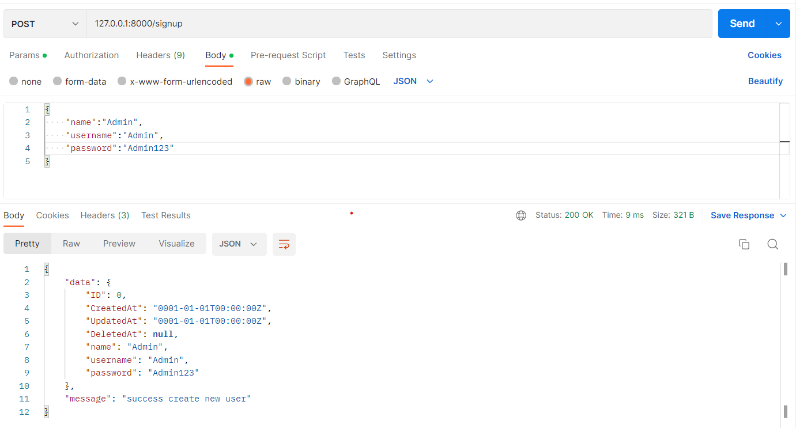
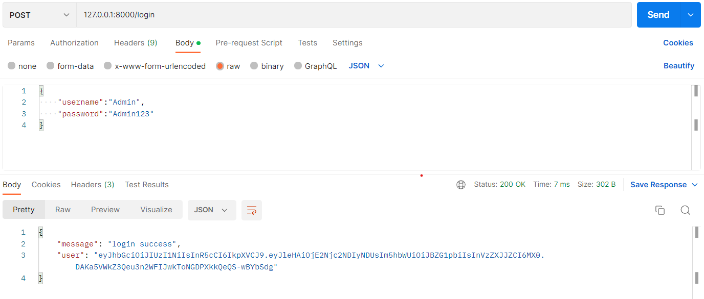
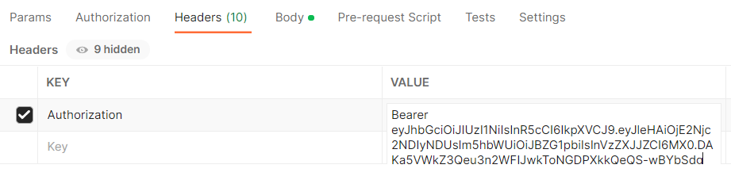
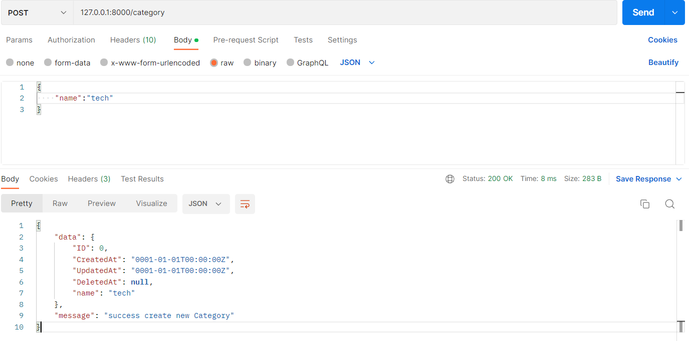
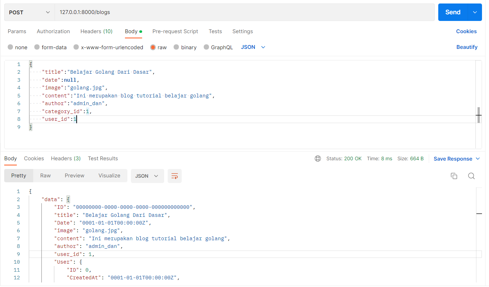
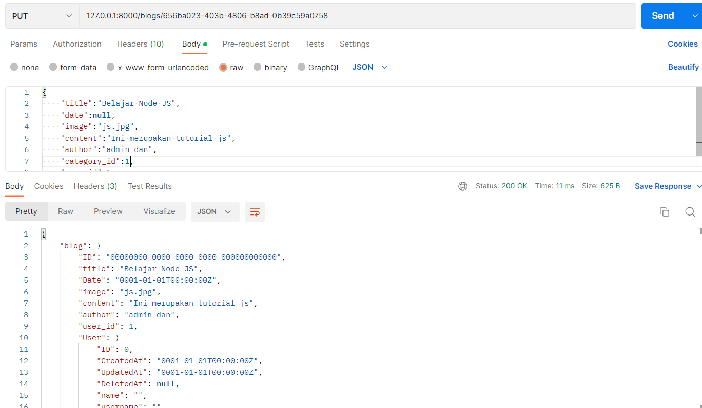
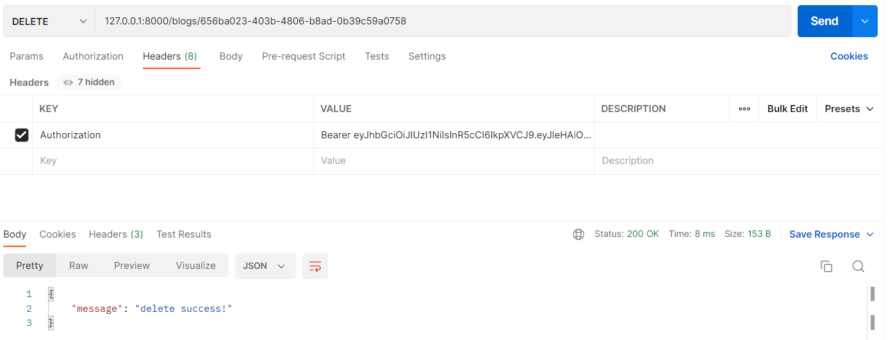
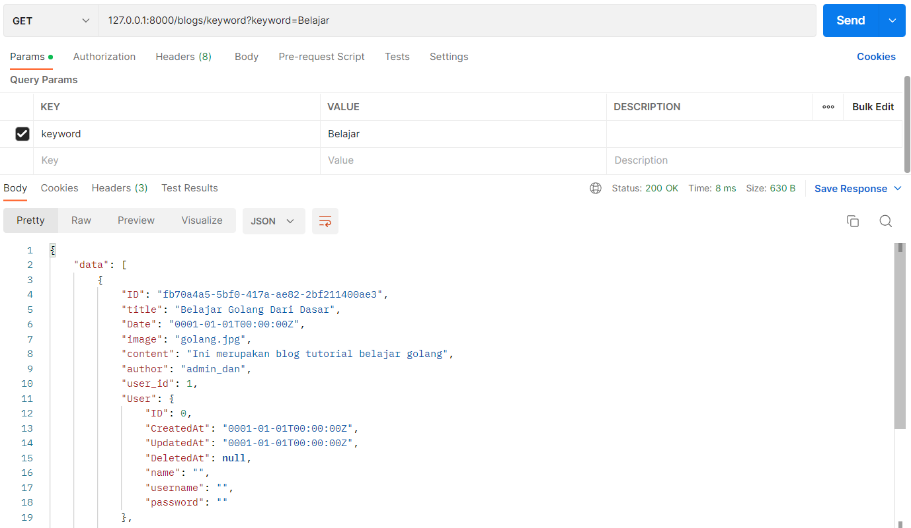

<h1 align="center">Weekly Task 3</h1>

<h2>Sign Up User (/signup)</h2>

    
     

<h2>Login User (/login)</h2>

    
     

<h2>Input Header Token Bearer For CRUD</h2>

    
     

<h2>Get All User (/users)</h2>

    
     

<h2>Create Category POST (/category)</h2>

    
     
    
     

<h2>Get All Category GET (/category)</h2>

    
     

<h2>Create Blog POST (/blogs)</h2>

    
     
    
     

<h2>Get All Blog GET (/blogs)</h2>

    
     

<h2>Update Blog (ID : 656ba023-403b-4806-b8ad-0b39c59a0758) PUT (/blogs/:id)</h2>

    
     

<h2>Get Blog By ID (ID : 656ba023-403b-4806-b8ad-0b39c59a0758) GET (/blogs/:id)</h2>

    
     

<h2>Delete Blog (ID : 656ba023-403b-4806-b8ad-0b39c59a0758) DELETE (/blogs/:id)</h2>

    
     

<h2>Get Blog By Category ID (ID : 1) GET (/blogs/category/:category_id)</h2>

    
     

<h2>Get Blog By Keyword (Keyword : Belajar) GET (/blogs?keyword=Belajar)</h2>

    
     

